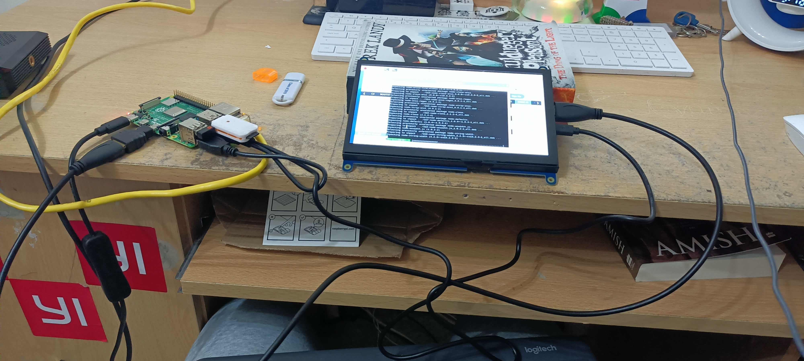

# Project Magic Mirror 
### Date:   DEC 2023- JAN 2024

Magic Mirror is my first product.

All the resources where very kindly provided by my Science Teacher (Dr Mcvean).

### My setup:
- 2x pi4 (2gb and 4gb ram size) 
- An external display  (touch screen)
- logitech external keyboard
- hdmi cables 
- display connectors (usually a split usb cable to usb micro )
- computer (optional)

### Plan
1. Get Magic Mirror from GitHub           
2. Check hardware compatibility 
3. Mod the Magic Mirror
 
(ALL THE BELOW WAS DONE BY DR MCVEAN )
4. Make a case and get 1 way Mirror.
5. Assembling the Mirror

With a pi 4 (2gb) and my own pi 4 I was able to quickly able to prototype
a basic Magic Mirror.
> **Image of whole setup**
>

Moreover, I quickly learnt json editing and the Magic Mirror environment so was able to start modding.

I learnt about electron and how it was  essential for running the Magic Mirror.
I was also  found a library of 3rd party mods for the magic mirror doing many of the things I wanted to make. 
I learned how enable and use mods in Magic  Mirror. I quickly added multiple mods 
> **Image of the screen and pi setup with initial Magic Mirror**
>
> **Image of modded magic mirror**
>

Although it looks easy, making sure the pi didn't overheat or that the 
2gb ram was not a limit to performance and that it could sustain 
long periods of use proved to be a challenge which made the project stretch 
form 1 week to 3 weeks
## USEFUL LINKS 
- https://magicmirror.builders/
- https://github.com/MagicMirrorOrg/MagicMirror/wiki/3rd-party-modules